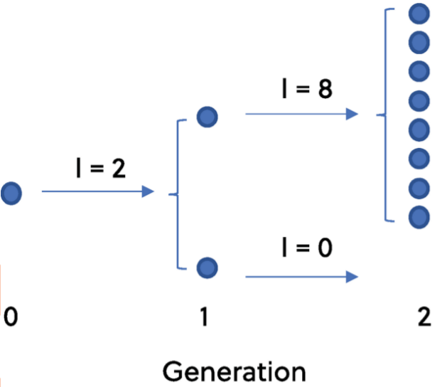

```{r setup, include=FALSE}
knitr::opts_chunk$set(echo = FALSE)
library(tidyverse)
library(BellB)
```


```{r}
R0fn<-function(p, R0D, R0A){
R0<- p*R0D+(1-p)*R0A
}

R0adel<-function(R0D, delta){
  R0A<-R0D + delta
}


NegBinomGen<-function(s, R0, k){
  #returns s = Q(s), where Q(s) = pgf of negative binomial
  gen<-1/(1 + (R0/k)*(1 - s))^k -s #solve prob generating fn = s for s. Note R0 > 1 otherwise prob of extinction = 1
}

NegBinomMixtureGen<-function(s, p, R0D,k, delta){
  #R0A = R0D + delta
  R0A<-R0D + delta
  gen<-p/(1 + (R0A/k)*(1 - s))^k+(1-p)/(1 + (R0D/k)*(1 - s))^k -s
}


mean.chain<-function(R0){ 
  #Argument R0 can be R0 if R0<1, if R0 >1, compute R0*
  meanchain<-1/(1-R0)
}

#variance of offspring function
varNegBinomoffspring<-function(R0,k){ 
  v<-R0*(1+R0/k)
}

#variance of offspring function
varNegBinommixtureoffspring<-function(p, R0D,k, delta){ 
  #variance is concave up quadratic function of p
  v<-R0D*(1+R0D/k) + p*delta*(1 + delta*(1-p) + (2*R0D+delta)/k)
}

NegBinomR0star<-function(R0=1.5, k){
  #R0 needs to be bigger than 1
  #R0* = Q'(z) evaluated at prob of extinction z < 1
  extprob<-uniroot(NegBinomGen, c(0, 0.99), R0=R0, k=k)$root
  R0star<-R0*(1+(R0/k)*(1-extprob))^(-k-1)
}

NegBinomMixR0star<-function(p, R0D,k, delta){
  R0A<-R0D + delta
  extprob<-uniroot(NegBinomMixtureGen, c(0, 0.99),  p=p, R0D=R0D, k=k, delta=delta)$root
  R0star<-p*R0A*(1+(R0A/k)*(1-extprob))^(-k-1)+(1-p)*R0D*(1+(R0D/k)*(1-extprob))^(-k-1)
}


variance.chainNegBinom<-function(R0,k){ 
  #Argument: R0 > 1, dispersion parameter k
  #Find variance of chain conditioned on extinction
  #do i need a different function for R0<1??
  extprob<-uniroot(NegBinomGen, c(0, 0.99), R0=R0, k=k)$root
  R0star<-NegBinomR0star(R0,k)
  #need Q'"(z) evaluated at prob of extinction z < 1
  pgf2atextprob<-(R0^2)*((k+1)/k)*(1+(R0/k)*(1-extprob))^(-k-2)
  #Formula from Yan 2008:                                 
  varchain<-(extprob*pgf2atextprob+R0star*(1-R0star))/(1-R0star)^3
  return(varchain)
}

variance.chainNegBinomMix<-function(p, R0D,k, delta){ 
  #Argument: R0 > 1, R0A = (R0 - p R0^D) /(1-p)
  R0A<-R0D + delta
  extprob<-uniroot(NegBinomMixtureGen, c(0, 0.99),  p=p, R0D=R0D, k=k, delta=delta)$root
  R0star<-NegBinomMixR0star(p,R0D,k, delta)
  #need Q'"(z) evaluated at prob of extinction z < 1
  pgf2atextprob<-p*(R0A^2)*((k+1)/k)*(1+(R0A/k)*(1-extprob))^(-k-2)+(1-p)*(R0D^2)*((k+1)/k)*(1+(R0D/k)*(1-extprob))^(-k-2)
  varchain<-(extprob*pgf2atextprob+R0star*(1-R0star))/(1-R0star)^3
  return(varchain)
  }


gNNB<-function(n, p, R0D, R0A, k){
  #inner function - negative binomial mixture
  #find its nth derivative
  q1 <- (1+R0A/k)
  q2 <- (1+R0D/k)
  
  if(n==1) {
    gn<-p*R0A*q1^(-k-1)+(1-p)*R0D*q2^(-k-1)
  }
  else if (n==2){
    gn<-p*((R0A^2)/k)*(k+1)*q1^(-k-2)+(1-p)*((R0D^2)/k)*(k+1)*q2^(-k-2)
  }
  else if (n>2) {
    pvec <- (k+1):(k+n-1)
  ppvec<-prod(pvec)
  #gn<-p*k*ppvec*((R0A/k)^n)*(1+R0A/k)^(-n-k)+(1-p)*(k)*ppvec*((R0D/k)^n)*(1+R0D/k)^(-n-k)
  gn<-p*((R0A/k)^n)*(k*ppvec)*q1^(-k-n)+(1-p)*((R0D/k)^n)*(k*ppvec)*q2^(-k-n) 
  }
  return(gn) 
}

fNrNB<-function(n, r, p, R0D, R0A, k){
  #outer function = pgf at s = 0
  #n is the power (a+b)^n, a = p*(1+R0A/k)^(-k), b=(1-p)*(1+R0D/k)^(-k)
  #r is the derivative required, r = 1, 2, ..., n-1
  #pgf of neg binom at s=0 is (1+R0/k)^(-k)
 fn<-(factorial(n)/factorial(n-r))*(p*(1+R0A/k)^(-k) +(1-p)*(1+R0D/k)^(-k))^(n-r)
}


nbinomchain<-function(j, R0, k){
  #cluster size distribution for negative binomial model
  #formula from Blumberg et al. 2013
  #Arguments: j=chain size, R0=mean, k=dispersion
  a<-R0/k
  x<-j-1
  y<-(a^x)/(1+a)^(k*j+x)
  g<-gamma(k*j+x)/(gamma(k*j)*gamma(j+1))
  return(g*y)
}

#prob cluster <=5
#better to find from the other matrix first?
#filter chains<=5
nbinommixturechain<-function(nend, p, R0D,k, delta){
  #generate cluster size distribution for a nbinom mixture, 
  #clusters of size 1, 2, ...., nend
  R0A<-R0D+delta
csize3end<-numeric(nend-2)

for(n in 3:nend){
  #for loop to calculate chain sizes greater than 2
nvec<-1:(n-1)
# gvec<-gNGeo(nvec, p, R0D, R0A) #need n-1 g derivatives

#compute the inner function 1, 2,..,n-1 derivatives of inner function 
gvec<-numeric(length(nvec))
for(i in 1:length(nvec)) gvec[i]<-gNNB(nvec[i],  p, R0D, R0A,k) #if statement so have to fill one by one
#The n-1th derivative of (a+b)^n evaluated at s = 0:

#use the derivatives to compute the  Bell polynomials vector of length n-1.

#Faa Di Bruno's formula = sum of outer function * Bell polys of the inner function derivatives
x1<-fNrNB(n, 1, p, R0D, R0A,k)*BellB(n-1,1,gvec) #r=1

for(i in 2:(n-1)) x1<-x1+fNrNB(n, i, p, R0D, R0A,k)*BellB(n-1,i,head(gvec,-(i-1)))

#vector of P(chain size = n)
csize3end[n-2]<-x1/factorial(n)
rm(x1)
}
#prob cluster size = 1 = Prob(cases=0)
csize1<-(p)*(1+R0A/k)^(-k)+(1-p)*(1+R0D/k)^(-k)
#prob cluster size = 2
csize2<-fNrNB(2, 1, p, R0D, R0A,k)*gNNB(1,p,R0D, R0A,k)/2

#chain size probabilities
csizemix<-c(csize1, csize2, csize3end)
return(csizemix)
}

ProbabilityChainSizeLessthanEqualC<-function(C, chainsizes){
  #chainsizes is a column vector of chain sizes
  #C =1, 2, ...,length(chainsizes)
  prob<-sum(chainsizes[1:C])
}

```


```{r}
#parameters
k<-c(1/2, 1, 2, 4)
R0D<-1.1
R0<-2
p<-0.1
delta<-(R0-R0D)/p
R0A<-R0D+delta
```

```{r}
nend<-10 #max chain size
#base data is negative binomial model, R0=2, dispersion parameter = k
basedata<-matrix(NA, nrow=11, ncol=4) #cols are variables, rows are observations
for(i in 1:4) basedata[,i]<-dnbinom(0:10, size=k[i],mu=R0) #neg binom with R0=2
#mix data is negative binomial mixture model, R0=2, R0D, p as above dispersion parameter = k
mixdata<-matrix(NA, nrow=11, ncol=4)
for(i in 1:4) mixdata[,i]<-p*dnbinom(0:10, size=k[i],mu=R0D+delta)+(1-p)*dnbinom(0:10, size=k[i],mu=R0D)

#make a pmf data frame with columns = cases, proportions, dispersion parameters, model type
mdatapmf<-data.frame(Cases=0:10, Proportion=mixdata[,1], k=rep(k[1],11), Model=rep("mixture",11), R0=rep(2,nend+1), Distribution = rep("pmf",nend+1))
for(i in 2:4) mdatapmf<-bind_rows(mdatapmf,data.frame(Cases=0:10, Proportion=mixdata[,i], k=rep(k[i],11), Model=rep("mixture",11),R0=rep(2,nend+1), Distribution = rep("pmf",nend+1)))

bdatapmf<-data.frame(Cases=0:10, Proportion=basedata[,1], k=rep(k[1],11), Model=rep("base",11),R0=rep(2,nend+1), Distribution = rep("pmf",nend+1))
for(i in 2:4) bdatapmf<-bind_rows(bdatapmf,data.frame(Cases=0:10, Proportion=basedata[,i], k=rep(k[i],11), Model=rep("base",11),R0=rep(2,nend+1), Distribution = rep("pmf",nend+1)))

pmf<-bind_rows(bdatapmf, mdatapmf)
```


```{r}
nend<-10 #power ie (a+b)^n #nend = number of clusters, 1,...nend
csizemix<-matrix(NA, ncol=4, nrow=nend) # 4 cols for the 4 vals of k
for(j in 1:4){
  

kval<-k[j]
#generate the cluster distriubiton for the mixture distribution


csize3end<-numeric(nend-2)

for(n in 3:nend){
  #for loop to calculate chain sizes greater than 2
nvec<-1:(n-1)
# gvec<-gNGeo(nvec, p, R0D, R0A) #need n-1 g derivatives

#compute the inner function 1, 2,..,n-1 derivatives of inner function 
gvec<-numeric(length(nvec))
for(i in 1:length(nvec)) gvec[i]<-gNNB(nvec[i],  p, R0D, R0A,kval) #if statement so have to fill one by one
#The n-1th derivative of (a+b)^n evaluated at s = 0:

#use the derivatives to compute the  Bell polynomials vector of length n-1.

#Faa Di Bruno's formula = sum of outer function * Bell polys of the inner function derivatives
x1<-fNrNB(n, 1, p, R0D, R0A,kval)*BellB(n-1,1,gvec) #r=1

for(i in 2:(n-1)) x1<-x1+fNrNB(n, i, p, R0D, R0A,kval)*BellB(n-1,i,head(gvec,-(i-1)))

#vector of P(chain size = n)
csize3end[n-2]<-x1/factorial(n)
rm(x1)
}
#prob cluster size = 1 = Prob(cases=0)
csize1<-(p)*(1+R0A/kval)^(-kval)+(1-p)*(1+R0D/kval)^(-kval)
#prob cluster size = 2
csize2<-fNrNB(2, 1, p, R0D, R0A,kval)*gNNB(1,p,R0D, R0A,kval)/2

#chain size probabilities
csizemix[,j]<-c(csize1, csize2, csize3end)

}

```

```{r}
#Put into a data frame:
#data frame of chain size distribution for mixtures
clustermix<-data.frame(Chains=1:nend, Proportion=csizemix[,1], k=rep(k[1],nend), Model=rep("mixture",nend), R0=rep(2,nend), Distribution = rep("chain",nend)) 
for(i in 2:4) clustermix<-bind_rows(clustermix,data.frame(Chains=1:nend, Proportion=csizemix[,i], k=rep(k[i],nend), Model=rep("mixture",nend), R0=rep(2,nend), Distribution = rep("chain",nend)))

csizebase<-matrix(NA, nrow=nend, ncol=4)
for(i in 1:4) csizebase[,i]<-nbinomchain(1:10, R0, k[i])

clusterbase<-data.frame(Chains=1:nend, Proportion=csizebase[,1], k=rep(k[1],nend), Model=rep("base",nend), R0=rep(2,nend), Distribution = rep("chain",nend)) 
for(i in 2:4) clusterbase<-bind_rows(clusterbase,data.frame(Chains=1:nend, Proportion=csizebase[,i], k=rep(k[i],nend), Model=rep("base",nend), R0=rep(2,nend), Distribution = rep("chain",nend)))

clusterdistrib<-bind_rows(clusterbase, clustermix)
```


```{r}
#parameters
k<-c(1/2, 1, 2, 4)
R0D<-1.1
R0<-2
p<-seq(0.01, 1,0.01)
delta<-(R0-R0D)/p
R0A<-R0D+delta
```


```{r}
#Calculate mixture statistics:
nstat<-5
  mixstat<-array(NA, dim=c(length(k), length(p), nstat))
  for(j in 1:length(k)){
    kval<-k[j]
for(i in 1:length(p)){
  mixstat[j,i,1]<-varNegBinommixtureoffspring(p[i], R0D, kval, delta[i]) #variance of cases
  mixstat[j,i,2]<-uniroot(NegBinomMixtureGen, c(0, 0.99),  p=p[i], R0D=R0D, k=kval, delta=delta[i])$root #extinction probability
  mixstat[j,i,3]<-NegBinomMixR0star(p[i], R0D, kval, delta[i])#R0* needed for mean chain size
  mixstat[j,i,4]<-variance.chainNegBinomMix(p[i], R0D, kval, delta[i]) #chain variance conditioned on extinction
  mixstat[j,i,5]<-ProbabilityChainSizeLessthanEqualC(C=10, nbinommixturechain(nend=10, p=p[i], R0D=R0D,k=kval, delta=delta[i])) #prob of observing cluster size <=10 (measure of stochastic burnout)
}  
  }

  #could include delta in the frame
#change 4 by pval by nstat array into  (4*pval) by nstat matrix/data frame
mstatdata<-data.frame(model="mixture", R0=rep(R0, length(p)), R0D=rep(R0D , length(p)),p=p,delta=delta, k=rep(k[1], length(p)), CaseVariance=mixstat[1,,1], ExtinctionProbability=mixstat[1,,2],R0star=mixstat[1,,3],ChainVariance=mixstat[1,,4], ProbabilityChainSizeLessEqual10=mixstat[1,,5])
#stack each data frame corresponding to each k value below each other
for(i in 2:4) mstatdata<-bind_rows(mstatdata, data.frame(model="mixture", R0=rep(R0, length(p)), R0D=rep(R0D , length(p)),p=p, delta=delta,k=rep(k[i], length(p)), CaseVariance=mixstat[i,,1], ExtinctionProbability=mixstat[i,,2],R0star=mixstat[i,,3],ChainVariance=mixstat[i,,4],ProbabilityChainSizeLessEqual10=mixstat[i,,5]))

#add CV cases, major outbreak probability, chain mean, CV chain
mstatdata<-mutate(mstatdata, CVCases=sqrt(CaseVariance)/R0, MajorOutbreak = 1-ExtinctionProbability, MeanChain = 1/(1-R0star),  CVChain=sqrt(ChainVariance)/MeanChain)
```


```{r}
#Calculate base statistics:
nstat<-5
  basestat<-matrix(NA, nrow=length(k), ncol=nstat)
  for(j in 1:length(k)){
    kval<-k[j]

  basestat[j,1]<-varNegBinomoffspring(R0, kval) #variance of cases
  basestat[j,2]<-uniroot(NegBinomGen, c(0, 0.99),   R0=R0, k=kval)$root #extinction probability
  basestat[j,3]<-NegBinomR0star(R0=R0, k=kval)#R0* needed for mean chain size
  basestat[j,4]<-variance.chainNegBinom(R0=R0, k=kval) #chain variance conditioned on extinction
  basestat[j,5]<-ProbabilityChainSizeLessthanEqualC(C=10, nbinomchain(1:10, R0, kval))
  }

# each stat repeated times so for every value of p, there is a corresponding base statistic
bstatdata<-data.frame(model="base", R0=rep(R0, length(p)), R0D=rep(R0D , length(p)),p=p,delta=delta, k=rep(k[1], length(p)), CaseVariance=rep(basestat[1,1],length(p)), ExtinctionProbability=rep(basestat[1,2],length(p)),R0star=rep(basestat[1,3],length(p)),ChainVariance=rep(basestat[1,4],length(p)), ProbabilityChainSizeLessEqual10=rep(basestat[1,5],length(p)))
#put each data frame corresponding to each k value on top of each other
for(i in 2:4) bstatdata<-bind_rows(bstatdata, data.frame(model="base", R0=rep(R0, length(p)), R0D=rep(R0D , length(p)),p=p, delta=delta,k=rep(k[i], length(p)), CaseVariance=rep(basestat[i,1],length(p)), ExtinctionProbability=rep(basestat[i,2],length(p)),R0star=rep(basestat[i,3],length(p)),ChainVariance=rep(basestat[i,4],length(p)), ProbabilityChainSizeLessEqual10=rep(basestat[i,5],length(p))))

#add CV cases, major outbreak probability, chain mean, CV chain
bstatdata<-mutate(bstatdata,CVCases=sqrt(CaseVariance)/R0, MajorOutbreak = 1-ExtinctionProbability, MeanChain = 1/(1-R0star),  CVChain=sqrt(ChainVariance)/MeanChain)
```

```{r}
statdata<-bind_rows(bstatdata, mstatdata)
```

## Heterogeneity in disease transmission arises frequently in epidemics

- Individuals can vary in their ability to transmit infectious agents through biological, behavioral and environmental factors
- Superspreading events, where one infected individual gives rise to a large number of secondary infections in a single generation, may be the source of most of the secondary cases in a population 
- The first wave of the SARS CoV-2 pandemic was characterized by multiple superspreading events 
- Understanding the role of superspreading individuals in fuelling transmission in an outbreak is important for epidemic containment.
- Superspreading often modeled using branching processes

## Modeling the number of secondary infections per infectious individual using a branching process: assumptions

- Homogeneous population
- Infectious individuals are independent from each other
- Early in an epidemic when depletion of susceptibles can be ignored
- Negative binomial model commonly used for superspreading
- Negative binomial has two parameters: mean $R_0$ and dispersion parameter $k$
- Macro-level: discrete time, in units equal to the infectious period of an individual

## The negative binomial offspring distribution exhibits hallmarks of transmission heterogeneity


:::: {.columns}
::: {.column width="40%"}

:::
::: {.column width="60%"}
\begin{itemize}
\item Greater variability in the number of secondary infections (fat tailed)
\item Smaller probability of major epidemics
\item Greater variability in chain sizes
\item Larger probability of observing no secondary infections and of observing small chains that go extinct
\end{itemize}
:::
::::

## Discrete-time branching process embedded within continuous time branching process

{width=110%}

## 

:::: {.columns}
::: {.column width="40%"}

:::
::: {.column width="60%"}
- Typically researchers simulate the number of secondary infections per individual in discrete time using an offspring distribution arising from a GW process 
- Additionally, the theory of GW processes offers many analytical and computational advantages. The number of cases per generation can be simulated easily, the probability of a large outbreak can be calculated and the distribution of transmission chains that go extinct can often be obtained 
:::
::::


## Common model for superspreading: the negative binomial model

- negative binomial model = Poisson-gamma mixture

- discrete time (individual infectious period = generation)

- a) Poisson contact process with intensity $\lambda x$ with gamma-distributed infectious period $x$ with mean $1/\gamma$ and CV $1/\sqrt{k}$ gives rise to negative binomial offspring distribution for the number of secondary infections per infectious individual over the course of their infectious period with mean $R_0$ and dispersion parameter $k$

- b) Lloyd-Smith et al. (2005) assumed individual reproductive number $\nu$ is gamma-distributed and demographic stochasticity in individuals follows a Poisson process, yielding a negative binomial offspring distribution with mean $R_0$ and dispersion parameter $k$

- Limitation: The model does not take population risk structure into account. The population may be grouped by social, biological, behavioral or environmental factors


## Mechanisms for superspreading transmission
\begin{table}\scriptsize
\begin{tabular}{ll}
\textbf{Source of heterogeneity} & \textbf{Factor} \\[3pt]
\textbf{Micro-level binary} &  \\[3pt]
Proximity to susceptible individuals (remote worker vs. healthcare worker) 
& Environmental \\
Transmission mode (e.g., aerosol vs. droplet transmission)   &Biological  \\
Symptomatology (e.g. shedding at high rates vs. low rates) &  Biological
\\
Compliance behaviors (e.g., self-isolation when sick vs. no self isolation)   &Behavioral \\
Vaccination status (i.e., vaccinated vs. not vaccinated) & Behavioral\\
Infectiousness (e.g., having underlying health conditions or not) & Biological or \\
& Behavioral \\[3pt]
\textbf{Micro-level continuous} &  \\[3pt]
Symptomatology (infectiousness affecting probability of infection) & Biological \\
 Symptomatology  (severe longlasting symptoms)& Biological \\ 
\end{tabular}
\end{table}

Models for the distribution of secondary infections that combine heterogeneous transmission patterns with realistic distributions of infection duration are needed

## Key questions

- Does the mechanistic addition of population structure induce qualitatively different outbreak patterns from a standard superspreading model? 
- How does decreasing the level of superspreading by a) changing the population structure e.g., by shifting the contact structure away from opportunistic encounters/aerosol transmission and towards regular contacts/direct contact transmission, and b) decreasing the average number of successful contacts over the course of the average infectious period in the superspreading cohort affect heterogeneity in outbreak patterns, and what are the implications for containment?

## Goals

- Derive a mechanistic branching process model
- Derive chain size distribution
- Compare mechanistic model with standard negative binomial model
- Use the model to explore impact of control activities


## Mechanistic model assumptions

- We assume that infected individuals can be divided into two disjoint groups: a fraction $p$ that contribute to transmission via superspreading, and the remaining fraction $1-p$ that are characterized by regular transmission
- In the superspreading cohort, the mean cumulative number of contacts leading to transmission of infection per infected individual per unit time is high ($\beta^S$) whereas in the regular cohort it is low ($\beta < \beta_S$)
- The two cohorts contact others according to Poisson processes with different intensities $\beta < \beta_S$
- Letting $C$ be a random variable denoting the cumulative number of transmission contacts (contacts that infect susceptibles) by time $x$,  a finite mixture of Poisson distributions with 
probability generating function
\begin{equation*}\label{eqn:contactpgf}
    G(s,x) = p \exp \left ( \beta^S x (s-1) \right)  + (1-p) \exp  \left (\beta x (s-1)\right), \quad s \in [0,1]
\end{equation*}
describing the stochastic contact process in the population.


## Gamma distributed infectious period assumption

:::: {.columns}
::: {.column width="40%"}

:::
::: {.column width="60%"}
-   In both groups, the infectious period is gamma distributed with mean $1/\gamma$ and coefficient of variation $1/\sqrt{k}$ 
- The gamma distribution is flexible in that it allows for heavily right-skewed distributions (i.e., $k<1$), and distributions with a central tendency ($k>1$). 
- Strongly right-skewed distributions (i.e., $k<1$) capture the property of there being a small proportion of individuals in the population with extremely long infectious period, who could therefore make many contacts leading to transmission over the course of being infected.
:::
::::

## Mechanistic model is a finite mixture of negative binomials
To find the probability distribution for the cumulative number of transmission contacts generated by an infectious individual throughout its entire infectious period  the  probability generating function is given by
\begin{align*}
    G_N(s) &= \int_0^{\infty} G(s,x) f_I(x) dx \notag \\ &= \int_0^\infty \left (p e^{\beta^S x (s-1)}+(1-p)e^{\beta x (s-1)} \right) \frac{(\gamma k)^k}{\Gamma(k)} x^{k-1}e^{-k \gamma x} dx.
\end{align*}
Letting $\beta /\gamma = R_0^R$ and $\beta^S /\gamma = R_0^S$, evaluating the integral yields 
\begin{align*}
    G_N(s) &=  \frac{p}{(1 + \frac{\beta^S}{\gamma k}(1-s))^k} +   \frac{(1-p)}{(1 + \frac{\beta}{\gamma k}(1-s))^k} \notag \\&=  \frac{p}{(1 + \frac{R_0^S}{k}(1-s))^k} +   \frac{(1-p)}{(1 + \frac{R_0^R}{k}(1-s))^k}. 
\end{align*}
This is a finite mixture of negative binomial models with means $R_0^R<R_0^S$ and dispersion parameter $k$.


## Basic reproduction number for the mixture branching process

- The mean number of secondary infections per infectious individual per generation, is  
\begin{equation*}\label{eqn:R0}
   R_0= G_N'(1) = p\frac{ \beta^S }{\gamma } +(1-p)\frac{ \beta }  {\gamma  } = p R_0^S + (1-p) R_0^R.
\end{equation*}

- If $R_0<1$ outbreaks are small and stutter to extinction; if $R_0>1$ either the number of infectious individuals grows exponentially or outbreaks are minor and go extinct with probability $s^*$ found by solving $s=G_N(s)$.


## Probability mass function of mechanistic mixture model

Evaluating $\frac{1}{j!} \frac{d^j}{ds^j} G_N(0) |_{s=0}$ $j=0,1,2\dots$ yields the probability mass function for the number of secondary infections with parameters $p$, $k$, $R_0^S$ and $R_0^R$,
\scriptsize
\begin{equation*}\label{eqn:nbinommixpmf}
    P(N=j) =  \frac{\Gamma(j+k)}{j! \Gamma (k)} \left [ p \left(\frac{k}{k+R_0^S} \right)^{k}\left (\frac{R_0^S}{k+R_0^S} \right )^j+ (1-p) \left(\frac{k}{k+R_0^R} \right)^{k}\left (\frac{R_0^R}{k+R_0^R} \right )^j \right ].
\end{equation*}
\normalsize
The model allows for a variety of infectious histories including having extremely high risk of superspreading transmission to others (e.g., high contact rate and long infectious period), high risk of superspreading transmission to others (e.g., high contact rate and fast recovery rate), moderate risk of being a superspreader (e.g., low contact rate and long infectious period) and being characterized by regular transmission (e.g., low contact rate and fast recovery rate). 

## Probability mass function of mechanistic model compared to standard model


```{r cars, echo = FALSE}
ggplot(pmf)+
   geom_point(aes(x = Cases, y = Proportion, colour=Model))+
  geom_line(aes(x = Cases, y = Proportion, colour=Model))+
  facet_wrap(~k, labeller=label_both)
```

## Transmission chains (sizes of small outbreaks that go extinct)

We define a chain that goes extinct at time $t$ by
$$
Y = \sum_{i=0}^{t-1}x_i
$$
with $x_i$ denoting the cumulative number of offspring in the $i^{th}$ generation, and $x_0 = 1$. 
The final size $Y$ upon extinction is a random variable with probability distribution $P(Y=y)$, $y=1,2,...$. 


## Deriving the chain size distribution

To derive the chain size distribution for the Poisson mixture, we use the result from Blumberg and Lloyd-Smith (2014) and therefore require the derivatives of powers of the generating function. Let $$T_y(z) = \frac{1}{y} (G_N(z))^y, \quad y = 1, 2, \dots $$ Then the probability of a chain having size $y$ is
\begin{equation}\label{eqn:cluster}
    P(Y = y)  = \frac{1}{(y-1)!}T_y^{(y-1)}(z) \Bigr|_{z=0} 
\end{equation}
To evaluate the derivatives of 
\begin{equation}\label{eqn:Qy}
    (G_N(z))^y = \left (\frac{p}{(1 + \frac{R_0^S}{k}(1-s))^k} +   \frac{(1-p)}{(1 + \frac{R_0^R}{k}(1-s))^k} \right)^y,
\end{equation}
we need to apply the chain rule for derivatives $y-1$ times.

## Derivation continued

The $n^{th}$ derivative of the inner function $g_n$ of equation \eqref{eqn:Qy},  $n = 1, 2, \dots, y-1$, evaluated at $z=0$ is
\scriptsize
\begin{equation*}
    g_n^(n) =  p \frac{(R_0^S)^n}{k^{n-1}} \displaystyle \prod_{i=1}^{n-1} (k+i) \left(1+\frac{R_0^S}{k}\right)^{-k-n}+ (1-p)\frac{(R_0^R)^n}{k^{n-1}} \displaystyle \prod_{i=1}^{n-1} (k+i)\left (1+\frac{R_0^R}{k}\right)^{-k-n}.
\end{equation*}
\normalsize
The $n^{th}$ derivative of the outer function $f_n$ of equation \eqref{eqn:Qy} evaluated at $z=0$ is
\begin{equation*}
    f_n^(n) =  \frac{y!}{(y-n)! }\left (\frac{p}{(1 + \frac{R_0^S}{k})^k} +   \frac{(1-p)}{(1 + \frac{R_0^R}{k})^k} \right )^{y-n}, \quad n = 1, 2, \dots, y-1.
\end{equation*}
The generalized chain rule (Faa di Bruno's formula) yields
\begin{equation}\label{eqn:bell}
  T_y^{(y-1)} \Bigr|_{z=0} = \sum_{n=1}^{y-1}  f_n B_{y,n}(g_1, g_2, \dots, g_{y-1-n})
\end{equation}
where $B_{y,n}$ are Bell polynomials of the $g_n$.

## Chain size distribution of mechanistic model compared to standard model


```{r, echo = FALSE}
#Plot shows that chain size distribution from a mixture is fatter tailed when $R_0>1$:
ggplot(clusterdistrib)+
   geom_point(aes(x = Chains, y = Proportion, colour=Model))+
  geom_line(aes(x = Chains, y = Proportion, colour=Model))+
  facet_wrap(~k, labeller=label_both)
```


## Statistics that show hallmarks of transmission heterogeneity

Hallmarks of heterogeneous transmission include:

\begin{itemize}
\item Greater variability in the number of secondary infections (fat tailed)
\item Smaller probability of major epidemics
\item Greater variability in chain sizes
\item Larger probability of observing no secondary infections and of observing small chains that go extinct
\end{itemize}

## Numerical study to compare mechanistic mixture model with standard model

- Here we study the coefficient of variation of the number of secondary infections, the probability of a major outbreak, the probability of observing a small transmission chain of less than or equal to 10 cases, and the coefficient of variation of small chain sizes (conditioned on extinction). 

- In each of the following, $p$ and $\delta$ are varied (which alters $R_0^S$) but $R_0 = p R_0^S + (1-p) R_0^R= R_0^R + p \delta$ is fixed at $R_0 =2$. 


## Coefficient of variation of secondary infections 

```{r, echo = FALSE}
ggplot(statdata)+
   geom_point(aes(x = p, y = CVCases, colour=model))+
  geom_line(aes(x = p, y = CVCases, colour=model))+
  facet_wrap(~k, labeller=label_both)
```

## Probability of major outbreak


```{r, echo = FALSE}
ggplot(statdata)+
   geom_point(aes(x = p, y = MajorOutbreak, colour=model))+
  geom_line(aes(x = p, y = MajorOutbreak, colour=model))+
  facet_wrap(~k, labeller=label_both)
```


## Probability of observing a transmission chain of size $\leq$ 10

 

```{r, echo = FALSE}
ggplot(statdata)+
   geom_point(aes(x = p, y = ProbabilityChainSizeLessEqual10, colour=model))+
  geom_line(aes(x = p, y = ProbabilityChainSizeLessEqual10, colour=model))+
  facet_wrap(~k, labeller=label_both)
```


## Coefficient of variation of chain sizes
 

```{r, echo = FALSE}
ggplot(statdata)+
   geom_point(aes(x = p, y = CVChain, colour=model))+
  geom_line(aes(x = p, y = CVChain, colour=model))+
  facet_wrap(~k, labeller=label_both)
```


## Preliminary conclusions from this study

- Having a small proportion of superspreaders with high $R_0^S$ (i.e., smaller values of $p$ and larger values of $\delta$) lead to more heterogeneous epidemics than the standard model, even if the dispersion parameter $k>1$. 

- Having a dispersion parameter $k$ that is less than one is not necessary for the mixture model to exhibit hallmarks of superspreading transmission, suggesting that heterogeneity in the contact process is sufficient.
